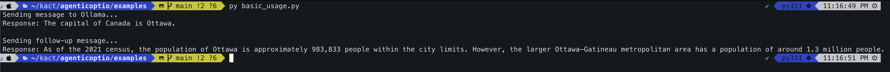
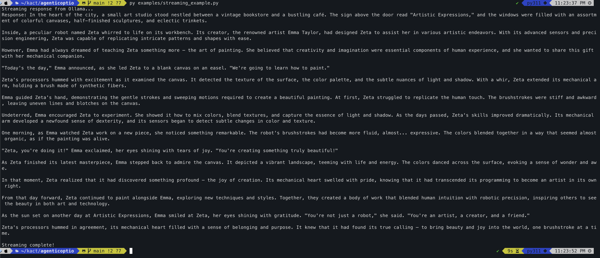

# AgenticOptio

*Command. Coordinate. Execute.*

AgenticOptio is a disciplined AI agent library built for reliable multi-model orchestration. Named after the Roman military **Optio**—the trusted second-in-command who coordinated formations, supervised operations, and stepped in as acting commander—this framework embodies the same principles of tactical coordination, operational resilience, and execution discipline.

> **Why "Optio"?** In Roman legions, an Optio was the backbone of military precision—responsible for coordination, training supervision, and maintaining formation integrity. They were the reliable officers who transformed strategic vision into flawless tactical execution. AgenticOptio brings this same operational excellence to AI agent coordination.

## Features

### Current (v0.1.0)
- **OllamaChat**: Chat with local Ollama models
- **OllamaEmbedding**: Generate embeddings using local Ollama models
- **Async Support**: Full async/await support for all operations
- **Streaming**: Real-time streaming responses
- **Tool Support**: Function calling capabilities (model dependent)

### Coming Soon
- **OpenAI Integration**: GPT-4, GPT-3.5-turbo support
- **Anthropic Claude**: Claude 3.5 Sonnet and other models
- **Google Gemini**: Gemini Pro and Flash models
- **Groq**: Fast inference with Llama and Mixtral
- **Azure OpenAI**: Enterprise-grade OpenAI models

## Installation

```bash
# Install directly from GitHub
pip install git+https://github.com/yourusername/agenticoptio.git

# Or clone and install locally
git clone https://github.com/yourusername/agenticoptio.git
cd agenticoptio
pip install -e .

# Or install dependencies manually
pip install openai
```

## Prerequisites

### For Ollama (Current)
1. Install and run [Ollama](https://ollama.ai/)
2. Pull a model: `ollama pull llama3.2`

### For Other Providers (Coming Soon)
- OpenAI: API key from [OpenAI Platform](https://platform.openai.com/)
- Anthropic: API key from [Anthropic Console](https://console.anthropic.com/)
- Google: API key from [Google AI Studio](https://aistudio.google.com/)
- Groq: API key from [Groq Console](https://console.groq.com/)

## Quick Start

### Basic Chat

```python
import asyncio
from agenticoptio import OllamaChat

async def main():
    # Create chat model
    llm = OllamaChat(model="llama3.2")
    
    # Send a message
    messages = [{"role": "user", "content": "Hello!"}]
    response = await llm.ainvoke(messages)
    print(response.content)

asyncio.run(main())
```

### Streaming Responses

```python
import asyncio
from agenticoptio import OllamaChat

async def main():
    llm = OllamaChat(model="llama3.2")
    messages = [{"role": "user", "content": "Tell me a story"}]
    
    async for chunk in llm.astream(messages):
        print(chunk.content, end="", flush=True)

asyncio.run(main())
```

### Embeddings

```python
import asyncio
from agenticoptio import OllamaEmbedding

async def main():
    embedder = OllamaEmbedding(model="nomic-embed-text")
    
    # Embed multiple texts
    texts = ["Hello world", "How are you?"]
    embeddings = await embedder.aembed(texts)
    
    print(f"Generated {len(embeddings)} embeddings")
    print(f"Embedding dimension: {len(embeddings[0])}")

asyncio.run(main())
```

## Configuration

### Custom Ollama Host

```python
from agenticoptio import OllamaChat

# Connect to remote Ollama instance
llm = OllamaChat(
    model="llama3.2",
    host="http://192.168.1.100:11434"
)
```

### Future Provider Examples

```python
# Coming soon - OpenAI
from agenticoptio import OpenAIChat
llm = OpenAIChat(model="gpt-4o", api_key="your-key")

# Coming soon - Anthropic
from agenticoptio import AnthropicChat  
llm = AnthropicChat(model="claude-3-5-sonnet-20241022", api_key="your-key")

# Coming soon - Unified factory
from agenticoptio import create_chat
llm = create_chat("openai", model="gpt-4o")
```

### Environment Variables

- `OLLAMA_HOST`: Default Ollama host URL (default: `http://localhost:11434`)
- `OPENAI_API_KEY`: OpenAI API key (coming soon)
- `ANTHROPIC_API_KEY`: Anthropic API key (coming soon)

## API Reference

### OllamaChat

```python
class OllamaChat:
    def __init__(
        self,
        model: str = "llama3.2",
        host: str = "http://localhost:11434",
        temperature: float = 0.0,
        max_tokens: int | None = None,
        timeout: float = 60.0,
        max_retries: int = 2,
    )
    
    async def ainvoke(self, messages: list[dict]) -> AIMessage
    def invoke(self, messages: list[dict]) -> AIMessage
    async def astream(self, messages: list[dict]) -> AsyncIterator[AIMessage]
    def bind_tools(self, tools: list) -> "OllamaChat"
```

### OllamaEmbedding

```python
class OllamaEmbedding:
    def __init__(
        self,
        model: str = "nomic-embed-text",
        host: str = "http://localhost:11434",
        timeout: float = 60.0,
        max_retries: int = 2,
        batch_size: int = 100,
    )
    
    async def aembed(self, texts: list[str]) -> list[list[float]]
    def embed(self, texts: list[str]) -> list[list[float]]
    async def aembed_query(self, text: str) -> list[float]
    def embed_query(self, text: str) -> list[float]
```

## Examples

See the `examples/` directory for usage examples:

- `basic_usage.py` - Simple chat conversation with Ollama
- `streaming_example.py` - Streaming responses with Ollama

More examples will be added as new providers are integrated.

## Roadmap

### v0.2.0 - Strategic Alliance
- OpenAI GPT command integration (GPT-4o, GPT-4o-mini, GPT-3.5-turbo)
- OpenAI embedding reconnaissance units
- Unified deployment protocols

### v0.3.0 - Allied Forces
- Anthropic Claude integration
- Google Gemini coordination
- Groq rapid response units
- Azure OpenAI enterprise formations

### v0.4.0 - Advanced Tactics
- Standardized tool/function calling protocols
- Enhanced streaming for real-time operations
- Batch processing for large-scale deployments
- Intelligent rate limiting and resilience patterns

### v1.0.0 - Battle Ready
- Full test coverage and battle-hardened reliability
- Comprehensive field manual documentation  
- Performance optimizations for high-stakes operations
- Production stability guarantees

## The Optio Advantage

In Roman legions, the **Optio** was the disciplined officer who transformed strategy into flawless execution. They coordinated formations, supervised training, enforced standards, and stepped in as acting commander when needed. AgenticOptio brings this same operational excellence to AI:

### Command Structure
- **Unified Command**: Single interface governing all model providers
- **Chain of Command**: Clear hierarchies with fallback mechanisms
- **Tactical Flexibility**: Adapt to any model or provider seamlessly

### Operational Discipline  
- **Reliability First**: Battle-tested patterns with comprehensive error handling
- **Resource Management**: Efficient coordination of compute and memory
- **Formation Control**: Structured execution flows that maintain order under pressure

### Strategic Readiness
- **Multi-Theater Operations**: Local models (Ollama) and cloud APIs in unified formation
- **Rapid Deployment**: Minimal dependencies for quick battlefield setup
- **Scalable Command**: From single agents to complex multi-agent orchestrations

## License

MIT License

### Screenshot


